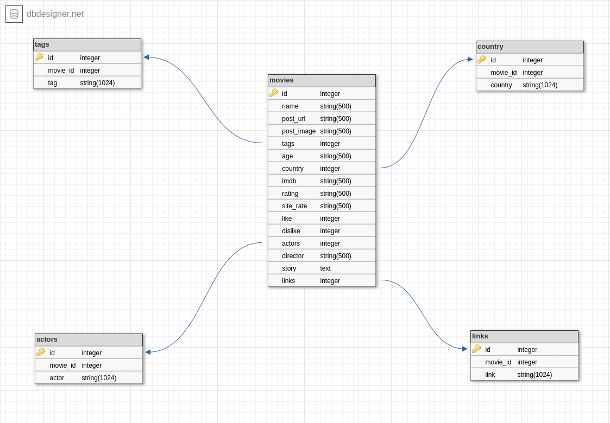

# Movie Crawler



- First install docker & docker compose.
  * [https://www.docker.com/get-started/]()
- Then run the following commands.
  ```
  $ sudo docker compose up
  ```
  * This Command will be build your own image and then after building run it.
  * Then you need to run the following commands again.
    * open terminal and type following command for create a new database:
        ```
      $ sudo docker compose exec -it database bash
      $ mysql -u root -p  
        ```
      * enter your password. default password is ram1999
      ```
      MariaDB [(none)]> CREATE DATABASE movieCrawl;
       ```
      * now you can exit from mariadb by typing ```exit``` in mariadb console.


  * open new terminal and type following command for migrate your database:
      ```
    $ sudo docker compose exec -it database bash migration.sh
      ```
  * good job, it's done. also you can change the celery settings in autoCelery folder.

### You can delete, add and Update movie, tag, country and ...
* import postman collection into your postman and check the api